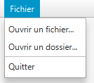
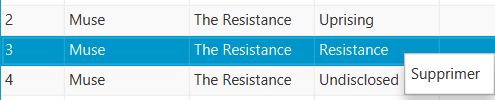

# Exercice 3 - Lecteur audio

- [Exercice 3 - Lecteur audio](#exercice-3---lecteur-audio)
  - [Objectifs](#objectifs)
  - [Ennoncé](#ennoncé)
    - [Création du menu](#création-du-menu)
    - [Classe](#classe)
    - [Gestion des fichiers audios](#gestion-des-fichiers-audios)
    - [Gestion de la playlist](#gestion-de-la-playlist)
      - [Menu contextuel](#menu-contextuel)
    - [Boutons de commandes](#boutons-de-commandes)
  - [Grille de notation](#grille-de-notation)

## Objectifs

L’objectif de cet exercice est de créer un lecteur de fichiers audios. Il permettra de mettre en application les compétences suivantes :

- Création de menus
- Utilisation des boutons
- Lecture de fichiers audios
- Manipulation de fichiers

## Ennoncé

### Création du menu

Mettre en place un menu qui permet de réaliser les actions suivantes :

- Ouvrir un ou plusieurs fichiers audios
- Sélectionner un dossier dans lequel chercher des fichiers audios
- Quitter le programme



_Exemple de menu_

L'option `Ouvrir un fichier` doit permettre de sélectionner un ou plusieurs fichiers qui seront ajoutés à la playlist actuelle. Seuls les fichiers audios doivent être affichés / sélectionnables.

L'option `Ouvrir un dossier` doit permettre de sélectionner un dossier. Une fois le dossier sélectionner, il doit être parcouru pour trouver tous les fichiers audios qu'il contient. Si le dossier sélectionner, vous afficherez un pop-up pour prévenir l'utilisateur qu'aucun fichier audio n'a été trouvé.

Pour la sélection des fichiers et des dossiers, vous avez à votre disposition respectivement [FileChooser](https://docs.oracle.com/javase/8/javafx/api/javafx/stage/FileChooser.html) et [DirectoryChooser](https://docs.oracle.com/javase/8/javafx/api/javafx/stage/DirectoryChooser.html) ([tutoriel](https://docs.oracle.com/javafx/2/ui_controls/file-chooser.htm)).

L'option `Quitter` doit permettre de fermer le programme.

Pour quitter le programme, Java propose la méthode `System.exit(int status)`. Le paramètre status indique le code de retour du programme avant de se terminer. Par convention, 0 est utilisé pour un programme qui se termine sans erreur et tous les autres codes signifient qu'il y a eu une erreur.

Ressource pour la création des menus (vidéos 21 & 22) : [lien](https://www.youtube.com/playlist?list=PL6gx4Cwl9DGBzfXLWLSYVy8EbTdpGbUIG)

### Classe

Une fois votre menu crée, vous allez devoir faire une classe pour mettre en forme les informations relatives aux fichiers récupérés. Celle-ci doit au minimum contenir les propriétés suivantes :

- Titre de la piste
- Album
- Artiste
- Durée
- Objet `Media` (plus d'informations sur ce point dans la suite du TP)
- Position du morceau dans la playlist (= ordre de lecture)

N'oubliez pas que l'on ne doit pas pouvoir accéder directement aux variables. Uniquement par le biais de getters / setters

### Gestion des fichiers audios

Pour jouer les fichiers audios, JavaFX propose deux classe : [AudioClip](https://docs.oracle.com/javafx/2/api/javafx/scene/media/AudioClip.html) et [Media](https://docs.oracle.com/javafx/2/api/javafx/scene/media/Media.html). Dans le cadre de ce TP, nous utiliserons la classe `Media`. **Cherchez la différence entre ces deux classes et justifiez le choix de `Media` plutôt qu'`AudioClip`**

Pour l'instanciation d'un objet `Media`, se référer à la JavaDoc.

Une fois instancié, l'objet `Media` vous permettra de récupérer les métadonnées associées au fichier : [getMetadata()](<https://docs.oracle.com/javafx/2/api/javafx/scene/media/Media.html#getMetadata()>). 


**/!\ Comme indiqué dans la JavaDoc, il se peut que les métadonnées ne soient pas entièrement disponibles lors de l'instanciation de l'objet. Vous pourrez utiliser la méthode ci-dessous, pour être "prévenu" lorsque les métadonnées sont mises à jour**

```java
media.getMetadata().addListener((MapChangeListener<String, Object>) change -> {
    if (change.wasAdded()) {
        System.out.println("Champ ajouté : " + change.getKey().toString());
        System.out.println("Valeur du champ : " + change.getValueAdded().toString());
    }
    else {
        System.out.println("Champ supprimé : " + change.getKey().toString());
    }
}
```

### Gestion de la playlist

Pour gérer votre playlist, vous allez utiliser un `TableView`. Il vous permettra de voir les éléments qui sont dans votre playlist et de les supprimer.

Ressource sur le fonctionnement des `TableView` (vidéos 17 à 20): [lien](https://www.youtube.com/playlist?list=PL6gx4Cwl9DGBzfXLWLSYVy8EbTdpGbUIG)


#### Menu contextuel

Ajouter un menu contextuel permettant de supprimer un élément de la playlist. 




### Boutons de commandes

Ajoutez les boutons permettant de démarrer la lecture, mettre en pause, passer au morceau suivant ou revenir au morceau précédent.

Idéalement, votre bouton de lecture est caché lorsqu'un morceau est joué et le bouton pause est caché lorsque le morceau est en pause


## Grille de notation

| Item | Points | Description |
| ---  | ---- | --- |
| JavaDoc | 25 | La javadoc est écrite pour toutes les fonctions et **complète**. -5 points pour chaque JavaDoc manquante / incomplète |
| Respect de l'énnocé | 30 | Toutes les fonctionnalités demandées dans l'énnoncé sont présentes dans votre programme
| UML | 10 | Au moins un diagramme est présent pour détailler votre système. Vous êtes libres de faire plusieurs diagrammes et de choisir le type de diagramme le plus adapté
| Logique | 10 | 
| Modularité et structure | 20 | Votre code est modulaire càd qu'il peut facilement être réutilisé à plusieurs endroits. Pas de copié / collé de parties de code. Vous essayez de garder vos fonctions assez courtes (50 lignes max) pour qu'elles restent facilement compréhensibles
| Github | 5 | Dépôt sur Github de la totalité de votre projet. Je dois pouvoir lancer le projet sans aucun problème après l'avoir cloné sur ma machine
| Total | 100 |

Votre rendu doit être fait sur Github et vous me déposerez le lien vers votre répertoire sur Léa. Aucune correction ne sera faite pour les projets qui ne sont pas rendus sur Github.


N'oubliez pas de déposer votre diagramme UML avec votre projet sur Github.